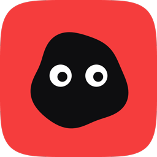
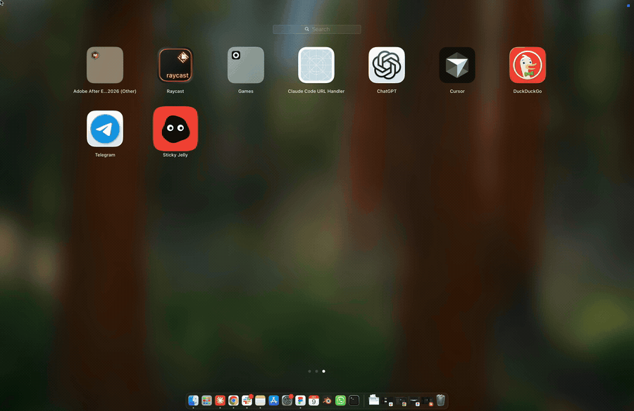
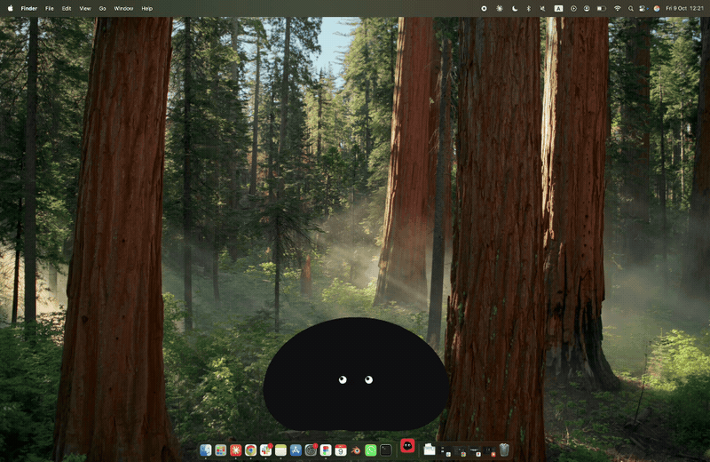
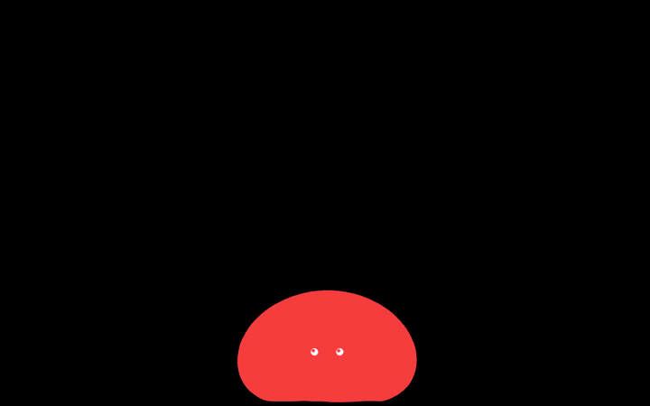
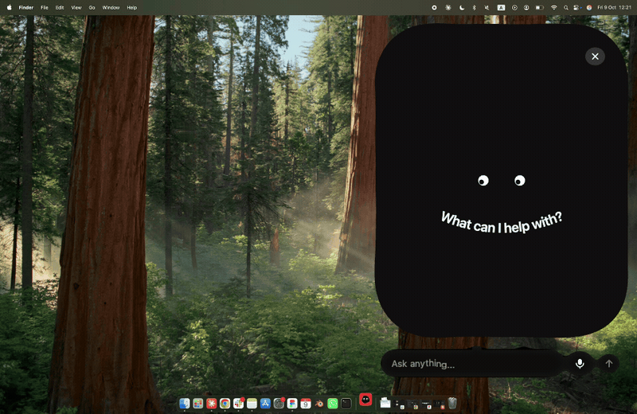
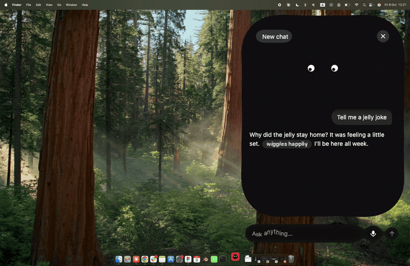
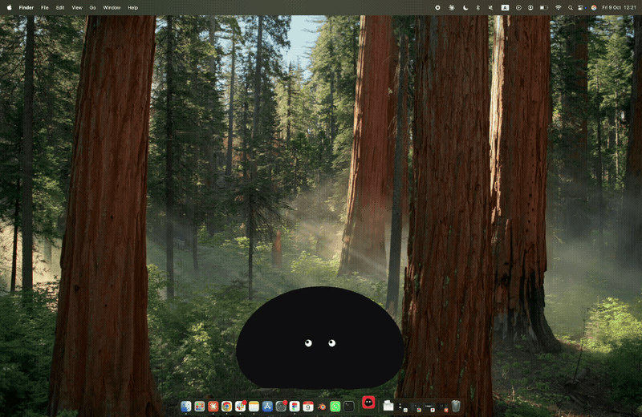
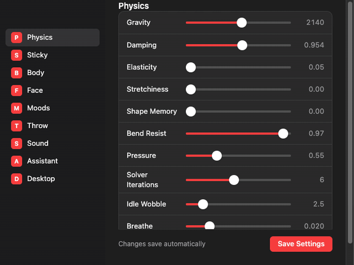

<p align="center">
  
</p>

<h1 align="center">Sticky Jelly</h1>

<p align="center">
  A soft-body creature that lives on your Mac desktop.<br>
  Grab it, fling it, stick it to the edges of your screen — and hold it to talk.
</p>

<p align="center">
  
</p>

Everywhere you are not touching it, your desktop works normally — the window only takes the mouse where the creature actually is.

> The recording at the top shows it live on a Mac. The other demos are recorded from the app itself, on the same desktop, a little closer in.

---

## Grab it, fling it, watch it stick

<p align="center">
  
</p>

Every point on the body grabs the edge it touches and holds until the pull beats its stickiness, then lets go one point at a time — so peeling it off a corner feels like peeling, not like a release.

It has moods: every few seconds the face changes — teeth, an arc of extra eyes, a cyclops, sleepy lids, a surprised O. The eyes follow your cursor a little late. It splats when it lands, pops as it peels and creaks while you stretch it, all synthesised; there are no audio files in here.

## Hold it to open the chat

Press and hold the jelly for a moment. It winds itself up — shaking harder, swelling, rolling its eyes and running through colours faster and faster, dizzy — then bursts up the nearer side of the screen into a tall sidebar, still a soft body the whole way. Its face sits in the middle with the question curved under it like a smile, and the message box oozes out of the bottom as a drop of the body itself.

<p align="center">
  
</p>

Esc or × lets it go, and it gathers itself back into a blob as it falls.

## Chat with it — it acts out what it says

Type and press Enter: the message box jiggles, three little drops bounce while it thinks, and the answer arrives word by word, each word dropping in like a blob landing. Its mouth moves while it talks.

It sounds the part, too — all synthesised, like its splats and pops: a bubble as your message leaves, little gurgles while it thinks, a babble of blips as the words land, a pop when it's done, and a sound for each thing its body does. Turn it up, down or off with **Chat Sounds** in Settings › Sound.

When it writes an action — *wiggles*, *bounces*, *blushes*, *spins*, *shivers*, *melts a little* — there are no asterisks on screen. The action becomes a little tag that moves the way it reads, and the jelly's body does the real thing at the same moment.

<p align="center">
  
</p>

## Talk to it

Press the microphone on the message box and speak. Your words appear as you say them and a pause sends them. Talk to it and it talks back out loud, mouth moving — you can switch that off in Settings.

Speech is recognised on your Mac with Apple's speech recognition: nothing is recorded, and it costs nothing. The first time, macOS asks for the microphone and for speech recognition.

<p align="center">
  
</p>

## Make it yours

Two bodies — a pressurised blob and a thick worm that slinks — in any colour. The chat follows the body colour, with light or dark lettering to match.

<p align="center">
  
</p>

## Settings

Everything lives in a real Settings window — from the jelly icon in the menu bar, or ⌘,. Physics, stickiness, body, face, moods, throw and sound apply as you drag, and are saved for the next launch (there is a Save Settings button too, for peace of mind).

<p align="center">
  
</p>

### Your API key

The chat runs on Claude, through your own Anthropic API key. Billing is per message to your Anthropic account, separate from any Claude subscription.

1. Sign in at [console.anthropic.com](https://console.anthropic.com), add a little credit under **Billing**, and create a key under **API Keys**.
2. Open **Settings › Assistant**, paste the key and press **Save**. It is stored encrypted in your Keychain and only ever sent to Anthropic.
3. To change it, paste a new one over it and press **Save**. To take it out, press **Remove**.

Pick the model in the same place. **Claude Haiku 5.5** is the default and the cheapest — roughly a twentieth of a cent a message. **Sonnet 5.5** and **Opus 5.5** are smarter and cost more.

## The desktop part

Four things make it a creature on your desktop rather than a window with a creature in it:

**Click-through, except on the body.** A transparent window still swallows every click that lands on it, which would put a dead rectangle over your files. So the window ignores the mouse by default, and the page tells the shell when your cursor is actually on the creature — the same test the grab uses, so anything you can click is something you could have grabbed.

**No frame, no dock icon.** It sits above ordinary windows, on every space, with a menu-bar item for Settings, About, Hide and Quit.

**The whole screen.** The window is the work area, so the edges it sticks to are your screen's edges.

**Icons get out of the way.** When the jelly comes to rest, any desktop icon under it is moved by Finder to the nearest free spot, and put back once the jelly leaves. Only on rest — Finder can't animate icons, so following a flung body would flicker. Where each icon came from is kept on disk, and everything goes home on quit (or on the next launch, after a crash). macOS asks once to let Sticky Jelly control Finder. A desktop sorted by name, kind or date is left alone, since Finder would put the icons straight back.

## Run it

```bash
npm install
npm run dev     # the creature in a browser tab, for working on it
npm run start   # build, then open it as a desktop app
npm run dist    # package Sticky Jelly.app and a .dmg into release/
npm run demo    # re-record the GIFs in this README (needs ffmpeg)
```

The listening is done by a small Swift helper, `desktop/listen/listen.swift`, built by `npm run build:listen` as part of `start` and `dist`; it needs the Xcode command-line tools. The app is Apple-silicon only and not signed, so on another Mac it opens with right-click › Open the first time.

## How it works

The body is a verlet soft-body: points with a previous position, a pressure term that keeps a ring inflated, and constraints that hold the shape without making it rigid. Physics runs in device pixels at a fixed 120Hz step, decoupled from the frame rate. The sidebar is the same body with every point pulled toward a rounded rectangle by a spring — a pull, not a placement — so it stretches into shape and keeps a little give.

Rendering is Three.js with an orthographic camera mapped one world unit to one pixel, so simulation coordinates are drawn without conversion. The outline is re-triangulated into a `BufferGeometry` every frame; the face is a pool of circle and triangle meshes that are moved rather than rebuilt.

The gooey controls are drawn twice: blobs behind, under an SVG blur-and-threshold filter that melts shapes together, and the real buttons and text on top.

The demos are recorded by `scripts/demo/record.cjs`: the real page in off-screen windows, driven by scripted input, with replies and speech scripted too — no API calls, no microphone.

## Where it came from

It began as a study on [davidbastian.black](https://davidbastian.black/?p=sticky-jelly) — one of a set of interface experiments — and became an app because a creature that sticks to the edges of a canvas wants to stick to the edges of a screen instead.

## Made by

**David Bastian** — [davidbastian.black](https://davidbastian.black) · [d@davidbastian.black](mailto:d@davidbastian.black)

## Licence

MIT © David Bastian
